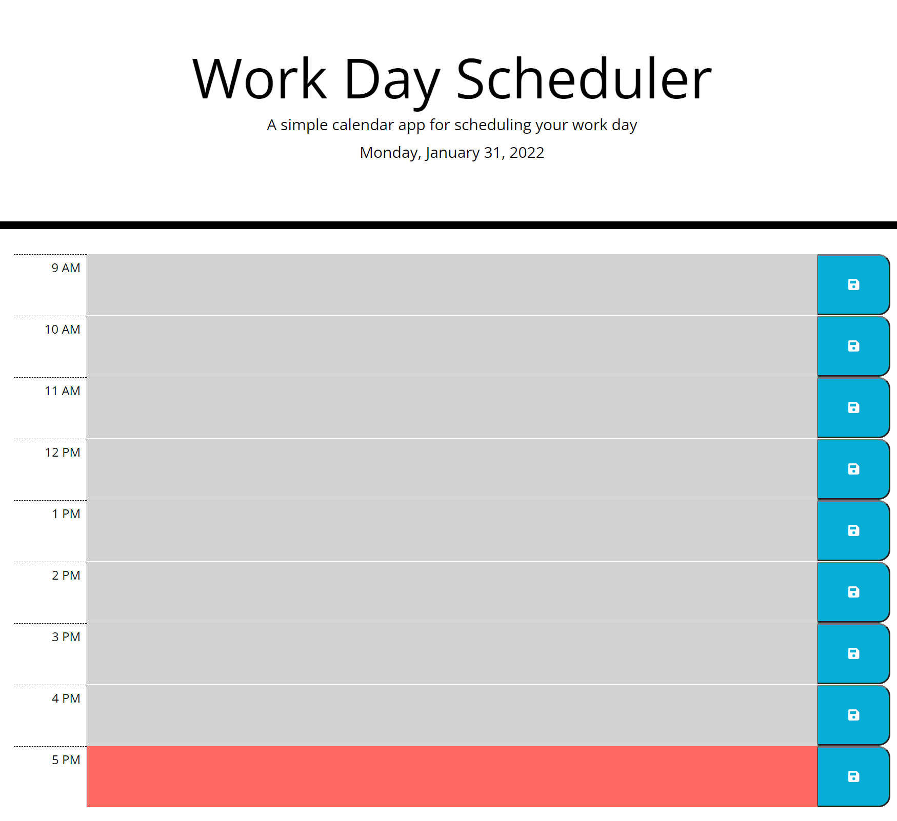

# DU-HW5-Work-Day-Scheduler

DU Coding Bootcamp Homework 5: Work Day Scheduler

# Website

This is a website with dynamically updated content via JavaScript. It writes to local storage and does not have functionality built in to clear the local storage objects.

Public Website Address: https://gittinit6.github.io/DU-HW5-Work-Day-Scheduler/

## Purpose

This website is specific to anyone that wants a simple day organizer.

* The Date is shown on the top of the screen.
* The user can add or change hourly entries for the current day.
* The current hour will show up red.
* Future hours will show up green.
* Past hours will show up grey.

## Audience

The intended audience is an individual that would have a need for a simple daily planner. The user of this site does not need to have a technical background.

## Technical Detail

This website uses HTML with an external linked CSS for style and external linked JavaScript code for functionality. It uses a grid using bootstrap and moment for calculating time.

**Responsive Design:** This website is designed to be responsive to smaller screens.

The files are configured as follows:
```
Root Directory
│
│ --index.html
│
└───assets (folder)
    │
    └─── css (folder containing css style files)
    │
    └─── images (folder containing all image resources)
    │
    └─── scripts (folder containing JavaScript files)

External Resources
[bootstrap]
[fontawesome]
[google fonts]
[moment]
```
>**CSS**: This site uses a single CSS file "style.css"

>**JavaScript**: This site uses a single JavaScript file "script.js"

>**Bootstrap**: This site uses grid fuctionality within bootstrap"

>**Moment**: This site uses moment to calculate time"

The following image shows a screenshot of the website homepage:



## Revision History 

1. This website was created in January 2022 as part of a bootcamp assignment. It was created using starter code provided by the instructor, then edited using Visual Studio Code.